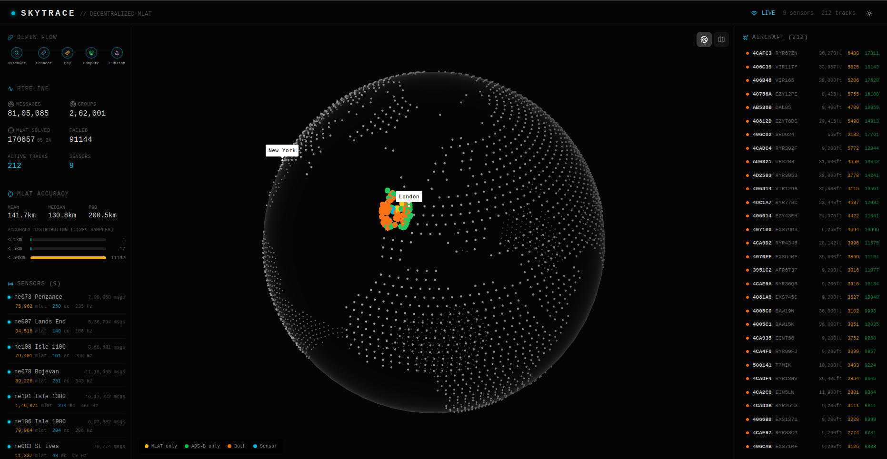
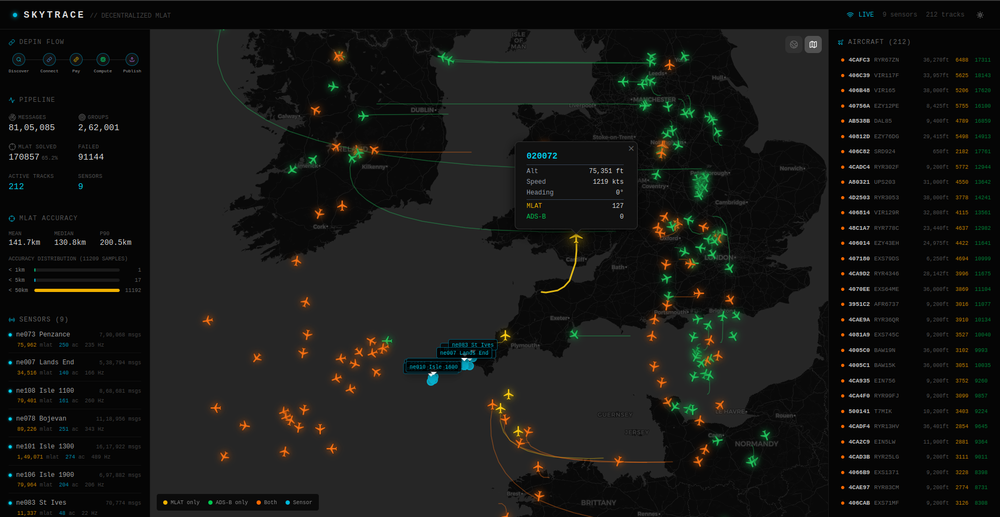
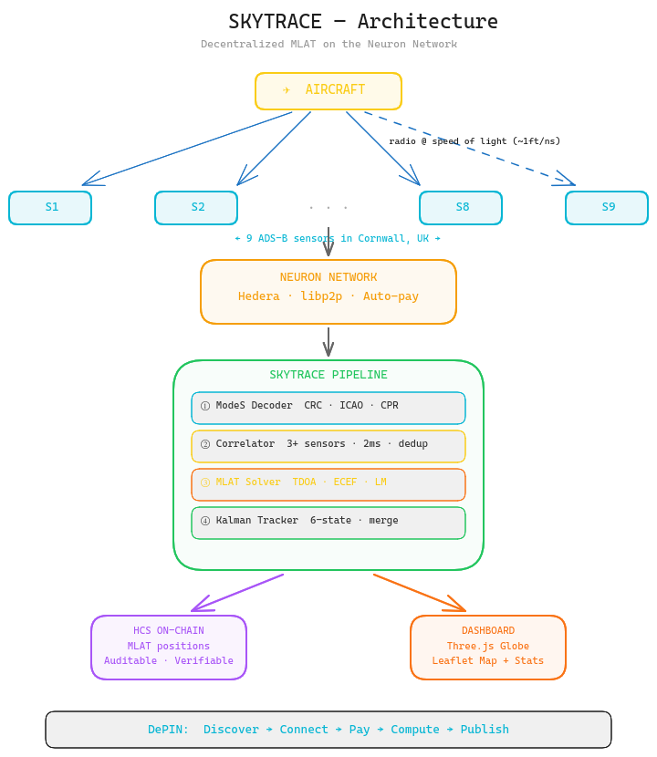
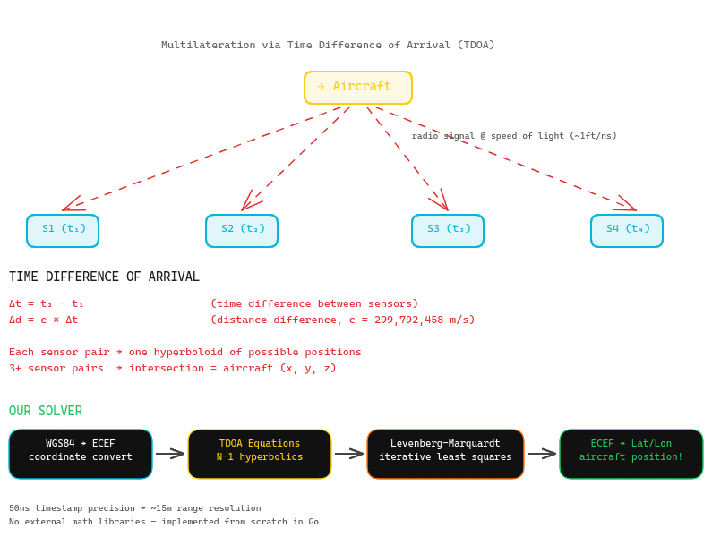

# SkyTrace — Decentralized MLAT on the Neuron Network

A decentralized airspace surveillance system that locates aircraft using multilateration (MLAT) on live radio signals purchased peer-to-peer from independent ADS-B sensors via the [Neuron](https://neuron.world) network on [Hedera](https://hedera.com).

Built for the **Neuron 4DSky MLAT Challenge** hackathon.





## What It Does

1. **Discovers** ADS-B sensors registered on a Hedera smart contract
2. **Connects** peer-to-peer via libp2p/QUIC (Neuron SDK)
3. **Pays** sensor operators automatically via Hedera shared accounts
4. **Decodes** raw ModeS radio signals (CRC-24, ICAO, callsign, CPR position, velocity)
5. **Correlates** the same aircraft transmission across 3+ sensors (nanosecond timestamp matching)
6. **Computes** aircraft positions via TDOA multilateration (Levenberg-Marquardt solver)
7. **Tracks** aircraft using a Kalman filter, merging MLAT + ADS-B fixes
8. **Publishes** results back to Hedera HCS topics (on-chain, auditable)
9. **Visualizes** everything on a live 3D globe + 2D map dashboard

## Architecture



## Tech Stack

| Layer | Technology |
|---|---|
| Sensor Network | Neuron SDK, libp2p, QUIC, Hedera HCS |
| Backend | Go 1.24+ |
| MLAT Solver | TDOA, ECEF coordinates, Levenberg-Marquardt (from scratch, no external math libs) |
| ModeS Decoder | CRC-24, DF11/DF17 parsing, CPR position decode |
| Tracker | 6-state Kalman filter in ECEF |
| API | WebSocket + REST (gorilla/websocket) |
| Frontend | React, TypeScript, Tailwind CSS, Three.js (globe), Leaflet (map) |
| Infrastructure | DigitalOcean VPS |


## Getting Started

### Prerequisites

- **Go** 1.24.6+
- **Node.js** 18+ and **pnpm**
- **Buyer credentials** from the [Neuron Discord](https://discord.gg/PeAbrrrq7Z)
- A machine with a **public IP** (VPS recommended — sensors can't reach you behind NAT)

### 1. Clone and install

```bash
git clone 
cd 

# Backend
go mod download

# Frontend
cd frontend && pnpm install && cd ..
```

### 2. Configure credentials

```bash
cp .buyer-env.example .buyer-env
# Edit .buyer-env with your credentials from Discord
```

### 3. Run live (on a VPS with public IP)

```bash
# Build
go build -o skytrace .

# Run — connects to sensors, starts WebSocket server on :8080
./skytrace --port=61336 --mode=peer --buyer-or-seller=buyer \
  --list-of-sellers-source=env --envFile=.buyer-env
```

### 4. Run offline (replay from log file)

```bash
# Collect data first, then replay
go run cmd/server/main.go --log log.txt --addr :8080
```

### 5. Start the frontend

```bash
cd frontend
pnpm dev
# Open http://localhost:5173
```

Update `vite.config.ts` proxy target to point to your backend (`localhost:8080` or VPS IP).

## CLI Tools

### Decode ModeS frames

```bash
# Decode a single hex frame
go run cmd/decode/main.go --hex 8d406440ea447864013c08792c43

# Decode entire log file with stats
go run cmd/decode/main.go --log log.txt
```

### Replay with full pipeline stats

```bash
go run cmd/replay/main.go --log log.txt --overrides location-override.json
```

## API Endpoints

| Endpoint | Description |
|---|---|
| `ws://host:8080/ws` | WebSocket — live track, sensor, stats updates |
| `GET /api/tracks` | All tracked aircraft |
| `GET /api/sensors` | Sensor positions and message counts |
| `GET /api/stats` | Pipeline statistics |
| `GET /api/accuracy` | MLAT accuracy vs ADS-B ground truth |
| `GET /api/sensor-quality` | Per-sensor quality metrics |

## How MLAT Works



Aircraft transmit radio signals that are received by multiple ground sensors at slightly different times (because radio travels at the speed of light, ~1 foot per nanosecond). By measuring the **Time Difference of Arrival (TDOA)** between sensor pairs and knowing the sensor positions, we solve a system of hyperbolic equations to find where the aircraft is.

Our solver:
- Converts sensor positions from WGS84 (lat/lon) to ECEF (Earth-Centered Earth-Fixed) coordinates
- Sets up N-1 TDOA equations from N sensors
- Solves using Gauss-Newton with Levenberg-Marquardt damping
- Tries 8 different initial guesses to avoid local minima
- Filters results by residual to reject bad solves
- Smooths with a Kalman filter for continuous tracks

## The DePIN Story

This isn't just MLAT math. It demonstrates a complete **Decentralized Physical Infrastructure Network**:

- **No central authority** — sensors are independently owned
- **Peer-to-peer data** — bought directly from sensor operators via Neuron
- **On-chain coordination** — discovery, signaling, and payment on Hedera
- **Transparent quality** — sensor performance is measurable and auditable
- **Edge computation** — MLAT runs on the buyer's machine, not a central server
- **Publishable results** — computed positions go back on-chain via HCS

## License

Apache-2.0
